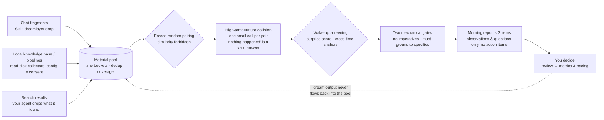
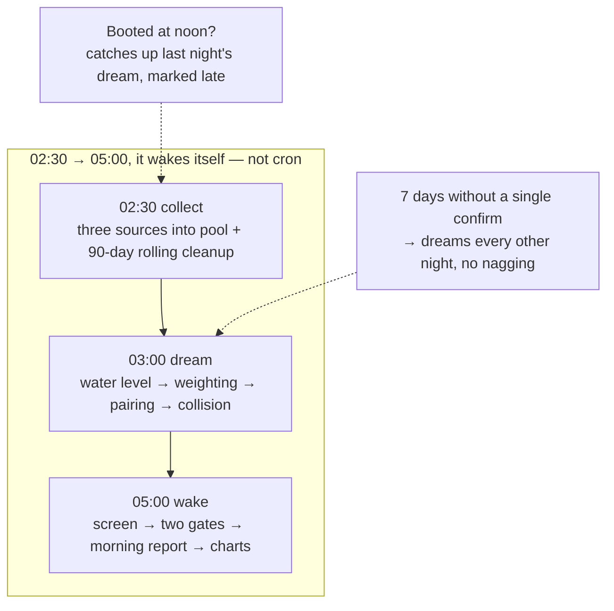

<p align="center">
  
</p>

<p align="center">
  <b>English</b> · <a href="README.zh-CN.md">中文</a>
</p>

<p align="center">
  
  
  
  
</p>

# Dream Layer

> Your systems see a lot every day — and throw a lot away.
> Dream Layer takes the fragments that flow through (including the ones you rejected), pairs them at random each night, collides them at temperature 1.2, and gives you **at most 3 observations + questions** in the morning.
> 95% of nights are noise. What we want is the occasional thing hiding in the noise — the thing you couldn't see while awake.

**The name is the command**: `dreamlayer drop` (feed a fragment) → `run --once` (dream one night) → `morning.md` (the report) → `review` (judge it).

## Why random pairing, not similarity

Similarity retrieval only finds what you're already looking for — that's search, and it's a solved problem. Insight, by definition, is *what you weren't looking for* colliding with something you already have. So pairing here is **forbidden from looking at content similarity**. The only "relevance" signal allowed is an accidental shared concrete detail: the same number, the same project name, the same rare word — appearing across time, which you never noticed.

```
A paper you read last week  ×  A new article today
  — sharing one name, and nobody ever pointed it out to you.
This is what the system catches.
```

## How one night works



Three sentences:

1. **Daytime is for collecting.** Chat waste, your authorized local files, things your agent searched for — all flattened into four fields (`content` + `time` required) into the pool. Rejected material gets *higher* weight: everyone saw what was selected; nobody saw what was dropped.
2. **Night is for colliding.** Two fragments at random, regardless of similarity, into temperature 1.2. Mirroring is memory consolidation — that field is crowded. We want two stones that strike a spark. "Nothing happened" is a legal answer — that honesty is a feature.
3. **Morning keeps three lines.** Most pairs are judged noise. Survivors of two mechanical gates — max 3 per day — become the morning report. Each entry is one observation, one question. No suggestions, no action items. The verdict is always yours.



## What a morning report looks like

Real output (rehearsal engine; the pipeline is identical to production):

```markdown
# morning · 2026-10-01

## 1. [cross_time · surprise 0.86] 2026-10-01-04

观察:WebFetch 这个细节在两条碎片里各自出现,隔着时间。
问题:WebFetch 后来怎么样了——上次拍板的理由还成立吗?
证据:315a291b(rejected · zcode 10-01) × 794ea727(selected · vault 08-07)

确认有效:dreamlayer confirm 2026-10-01-04 cross_time
不当真也没关系——这本来就可能是 95% 的那部分。
```

A failed `WebFetch` in today's chat session, paired with a note in your knowledge base from 54 days ago — that's the cross-time moment this system exists to catch.


## Install & run

```bash
cd dream-layer
python -m venv .venv
.venv/Scripts/pip install pyyaml openai pytest    # openai only needed for real engine (lazy-loaded)
.venv/Scripts/python -m pytest -q                 # 179 tests, all FakeLLM, zero network
.venv/Scripts/python -m dreamlayer run --once --fake   # zero cost, watch one fake night first
```

Real engine: any OpenAI-compatible endpoint (`config/engine.yaml`, change `base_url`/`model`), key via env var `DREAM_LLM_API_KEY`. Optional: `DREAM_WEBHOOK_URL` (morning report push, Feishu/Slack auto-detected), `DREAM_DROP_TOKEN` (drop endpoint token).

| Config file | Governs |
|---|---|
| `weights.yaml` | Who deserves to be dreamed (five-value weights, zero hardcoding in core) |
| `rhythm.yaml` | Bedtime/wake time, water level, temperature, pairing constraints, collectors |
| `privacy.yaml` | What is never read (deny-by-default, before reading), journal stays local, `mode` |
| `engine.yaml` | Any OpenAI-compatible endpoint |

## Privacy (read this first)

> **By default, material content is sent to the cloud engine** (`base_url` in `engine.yaml` — Zhipu by default). Path-level leaks (`.env`, keys, cloud-sync dirs) are blocked *before* reading, but "your notes go to a third-party API" is ON by default.
>
> For "dreams never leave this machine": set `mode: local_only` in `privacy.yaml` and point the engine at a local endpoint (e.g. ollama at `http://127.0.0.1:11434/v1`). In `local_only` mode, a non-local `base_url` **refuses to start**.

## For agents: the Skill

Ships with [`skills/dream/SKILL.md`](skills/dream/SKILL.md). Copy it into your host's skills directory (Hermes / ZCode / any SKILL.md-capable host), and the agent learns four moves:

```bash
python -m dreamlayer drop "abandoned idea: mount waker into cron" --tag discarded --origin zcode
python -m dreamlayer run --once                # dream one night (scheduled or manual)
python -m dreamlayer review                    # interactive judging: 1/2/3 confirm, s skip
python -m dreamlayer review --batch "2026-10-01-12:cross_time"   # batch, after collecting verdicts in chat
```

Red lines are written into the skill file: the agent only feeds and relays; dream output never flows back; no action items; no verdicts on your behalf.

## The experiment & the kill switch

This project is a bet: **random pairing can surface insight that similarity cannot reach.** A bet must be falsifiable:

- **A/B control experiment**: set `experiment: { ab: true }` in `rhythm.yaml` — nights alternate between arm A (pure random pairing) and arm B (half anchor pairs + half random). `dreamlayer metrics` reports confirm rates per arm. After 8 weeks, the data answers: does the value come from the pairing mechanism, or from the screening salvage?
- **Kill switch**: **after 90 days, if confirmed useful reflux < 3, the project archives itself** — the fallback charts (drift / threshold-band curves) get released as a standalone tool. Pre-committing an exit condition is the only weapon against sunk cost — and the answer to "this framework can't be falsified": it has an execution date.

Metrics (first 8 weeks are baseline calibration, not promises): rescue-from-rejection count · trend-warning hits (14-day reconciliation) · cross-time confirmations · dream yield · **presence metric** (do you start looking forward to the morning report after two weeks — subjective but decisive).

## Repo layout

```
dream-layer/
├── pyproject.toml            # Python ≥3.11; runtime: pyyaml + openai (lazy)
├── config/                   # four yaml files (see above)
├── skills/dream/SKILL.md     # agent integration (Hermes / ZCode)
├── site/index.html           # project intro page (single file, zero deps)
├── docs/brainstorm/          # red/blue adversarial review + final audit
├── dreamlayer/
│   ├── __main__.py           # CLI: run / drop / review / confirm / metrics / listen
│   ├── contract.py           # four-field contract, truncation, summary-first
│   ├── privacy.py            # path exclusion / redaction (precompiled) / cloud-dir refusal
│   ├── pool.py               # pool: dedup / buckets / weighting / pairing / cleanup
│   ├── dreamer.py            # collision: prompt skeleton / personas / refusal retry
│   ├── waker.py              # screening: surprise + cross-time anchors + two gates
│   ├── sink.py               # morning.md rendering + webhook push
│   ├── reflux.py             # confirm log / interactive review / quiet cycle
│   ├── metrics.py            # five metrics + drift/band SVGs (hand-built, zero deps)
│   ├── drop_server.py        # POST endpoint (stdlib only, 127.0.0.1 by default)
│   ├── journal.py            # dream journal + jsonl I/O
│   ├── scheduler.py          # collect/dream/wake phases + catch-up + pacing
│   ├── engine.py             # FakeEngine / OpenAI-compatible (lazy openai)
│   └── collectors/           # read_disk(jsonl/log/md/mdfile) / drop / demo
├── data/                     # runtime artifacts (gitignored; seed/ ships)
└── tests/                    # 179 tests, FakeLLM, zero network
```

## Known limitations (said upfront)

- **Verdicts are machine-nominated** (cross-time anchors lock `cross_time`, surprise scores tentatively `trend`) — the final call is always the human `confirm`;
- **95% of nights are noise** — dream yield stays low by design; adjusting randomness for hit rate is an explicitly forbidden change;
- **`meta.pool` counts raw collected lines (including duplicates)**; pair count is capped by "each material in at most 1 pair per night";
- **The threshold-band chart is a generic proxy** (daily rejected+hesitated counts); real business thresholds are carried by the collectors;
- **After 7 days with zero confirms → dreams every other night** (`mode: off` to disable) — it lowers its own presence;
- Roadmap (P2): Windows service / docker compose, MCP Events subscription, local engine presets.

## Acknowledgments & lineage

Design debate with SCM (arXiv 2604.20943, the only prior REM implementation) is documented in the PRD; the adversarial red/blue review that shaped this release lives in [`docs/brainstorm/`](docs/brainstorm/). Inspired by Koestler's bisociation, REM reactivation research, and fifty years of Oblique Strategies.

**All frameworks gave agents wakefulness. Some gave it deep sleep. This one adds dreams — it looks at what you threw away, one more time.**
