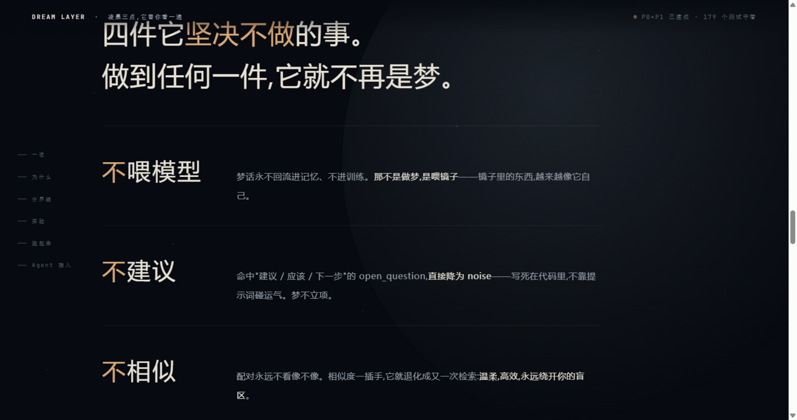
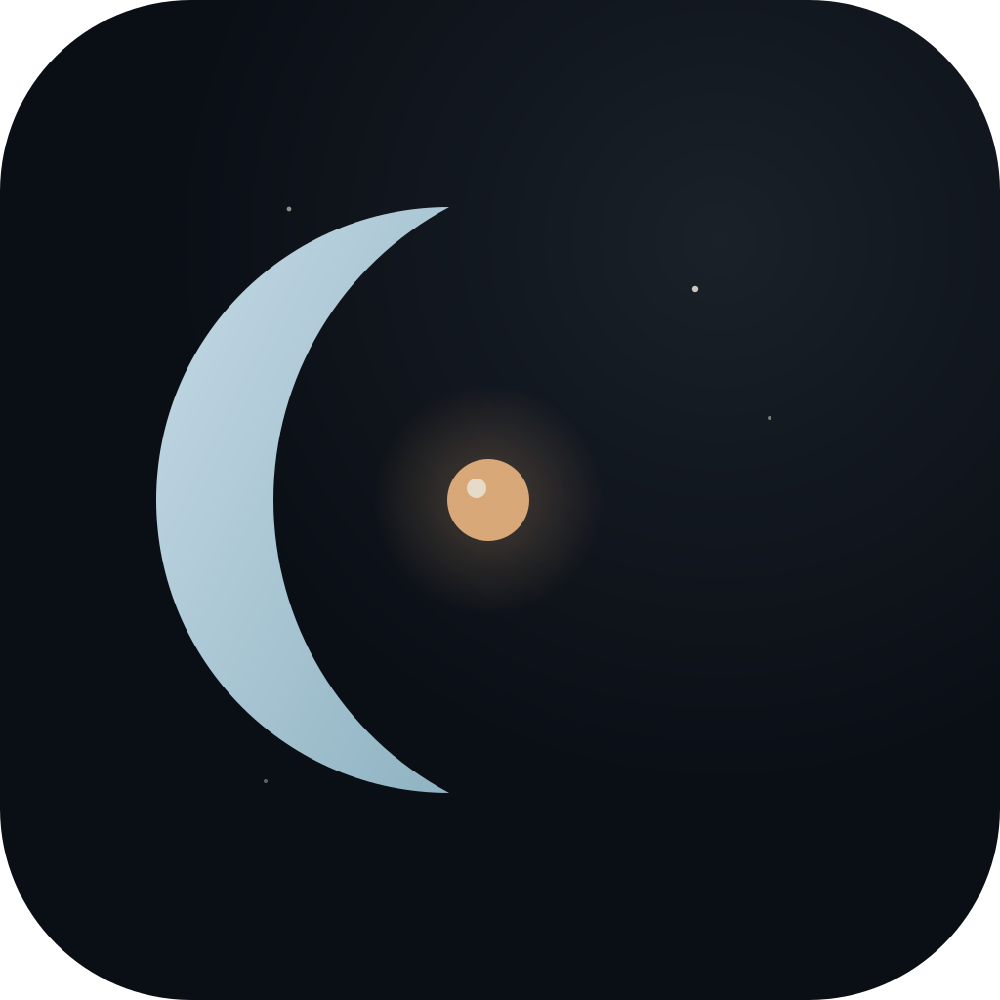
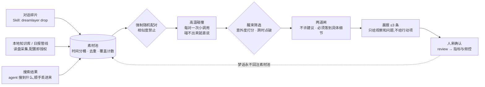
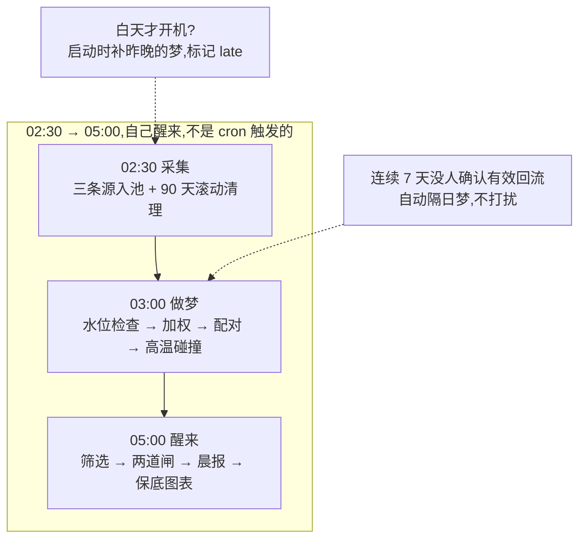
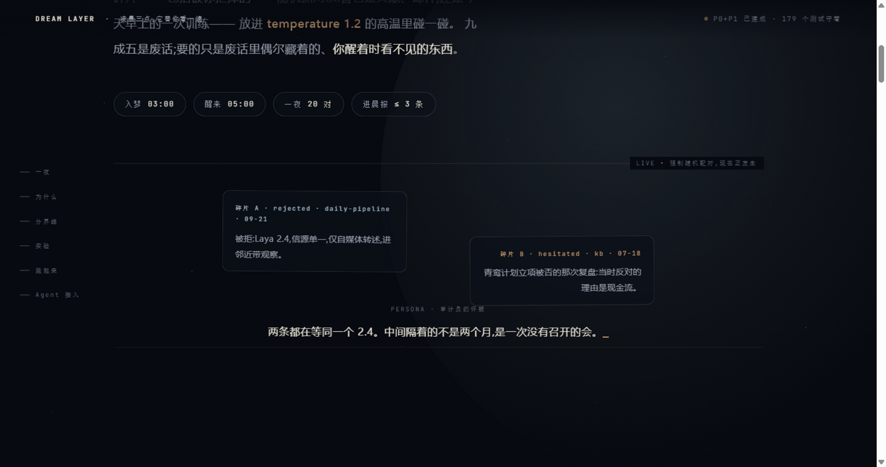

<p align="center">
  
</p>

<p align="center">
  <a href="README.md">English</a> · <b>中文</b>
</p>

<p align="center">
  
  
  
</p>

#  Dream Layer

> 你的系统每天流过很多东西,也扔掉了很多。
> Dream Layer 在夜里把这些碎片(包括被扔掉的)随机配对、高温碰撞,早上给你 ≤3 条「观察 + 问题」。
> 九成五是废话;要的只是废话里偶尔藏着的、你醒着时看不见的东西。

**名字就是命令**:`dreamlayer drop`(丢废料)→ `run --once`(做一夜)→ `morning.md`(晨报)→ `review`(过审)。

## 为什么是"随机配对",而不是"相似度抓取"

相似度找到的,永远是你正在找的——那叫检索,已经有人做完了。启发的定义就是"你没想找的东西撞上了你已有的东西"。所以这里配对**禁止看内容像不像**,唯一的"相关"信号是两条碎片偶然共享的具体细节:同一个数字、同一个项目名、同一个低频词——跨着时间出现,你从来没发觉。

```
一周前读过的文献 × 今天撞见的新文章
  ——共享同一个名字,没人替你点破
这就是这条系统要抓的东西。
```

## 一夜是怎么工作的



三句话版本:

1. **白天只管收集**:对话里的废料、你授权的本地文件、agent 搜到的东西,统统压扁成四字段(content + time 必填)进素材池。被拒的权重反而更高——白天所有人都看过入选的,没人看过它们。
2. **夜里只做碰撞**:随机抓两条,不管像不像,放进 temperature 1.2 的高温里碰。像镜子的那叫记忆巩固,满地都是;这里要的是撞出火花的两块石头。碰不出来就说碰不出来,这不算失败。
3. **早上只留三句**:绝大多数判 noise;活过两道闸的最多三条,写进晨报。每条是一个观察,一个问题。没有建议,没有行动项——拍板永远是你。



## 晨报长什么样

真实产出(彩排引擎,链路与生产完全一致):

```markdown
# morning · 2026-10-01

## 1. [cross_time · surprise 0.86] 2026-10-01-04

观察:WebFetch 这个细节在两条碎片里各自出现,隔着时间。
问题:WebFetch 后来怎么样了——上次拍板的理由还成立吗?
证据:315a291b(rejected · zcode 10-01) × 794ea727(selected · vault 08-07)

确认有效:dreamlayer confirm 2026-10-01-04 cross_time
不当真也没关系——这本来就可能是 95% 的那部分。
```

今天会话里失败的 WebFetch,和你知识库里 54 天前的一条笔记,被配到了一起——这就是这个系统存在要抓的"跨时点破"。



## 安装与运行

```bash
cd dream-layer
python -m venv .venv
.venv/Scripts/pip install pyyaml openai pytest    # openai 仅真实引擎需要(懒加载)
.venv/Scripts/python -m pytest -q                 # 179 个用例,全 FakeLLM 零网络
.venv/Scripts/python -m dreamlayer run --once --fake   # 零花费,先看一夜假梦
```

真实引擎:任一 OpenAI 兼容端点(`config/engine.yaml` 改 `base_url`/`model`),密钥走环境变量 `DREAM_LLM_API_KEY`。可选:`DREAM_WEBHOOK_URL`(晨报推送,飞书/Slack 自动区分)、`DREAM_DROP_TOKEN`(listen 端点令牌)。

| 配置文件 | 管什么 |
|---|---|
| `weights.yaml` | 谁值得被梦见(五值权重,core 零硬编码) |
| `rhythm.yaml` | 几点睡几点醒、水位、温度、配对约束、采集器 |
| `privacy.yaml` | 哪些永远不看(默认 deny,先于读取)、journal 只落本地、`mode` |
| `engine.yaml` | 梦见谁都可以(OpenAI 兼容端点即插即换) |

## 隐私(说在前面)

> **默认配置下,素材内容会随 prompt 发往云端引擎**(`engine.yaml` 的 `base_url`,默认是智谱)。密钥、`.env`、云目录这些路径级泄漏我们在读取之前就拦掉了,但"你的笔记内容发给第三方 API"这件事,默认是开着的。
>
> 要"梦话不出本机":`privacy.yaml` 里 `mode: local_only`,并把引擎指到本地端点(ollama 等,`base_url: http://127.0.0.1:11434/v1`)。local_only 模式下,base_url 非本机地址会直接拒绝启动。

## 给 Agent 用:Skill

仓库自带 [`skills/dream/SKILL.md`](skills/dream/SKILL.md)。复制到宿主的 skill 目录(Hermes / ZCode 或任何会读 SKILL.md 的宿主),agent 就学会四个动作:

```bash
python -m dreamlayer drop "废弃方案:把 waker 挂进 cron" --tag discarded --origin zcode
python -m dreamlayer run --once                # 做一夜(夜里触发或手动)
python -m dreamlayer review                    # 交互过审:逐条看晨报,1/2/3 确认,s 跳过
python -m dreamlayer review --batch "2026-10-01-12:cross_time"   # 对话收集后批量登记
```

红线写死在说明书里:agent 只投料与转述;梦话永不回注;不立项,不定案。

## 实验与退出条件(kill switch)

这个项目是一场赌注:**随机配对能撞出相似度够不着的洞见。** 赌注就必须可证伪:

- **对照实验**:`rhythm.yaml` 加 `experiment: { ab: true }`,按日期交替 A 夜(纯随机配对)/ B 夜(一半锚点对+一半随机对),`dreamlayer metrics` 分组展示确认率——8 周后回答"战果来自配对机制,还是筛选打捞"。
- **退出条件**:**90 天后,若有效回流(人工确认)少于 3 条,项目归档**,保底图表(漂移图/邻近带曲线)拆成独立小工具发布。预先承诺退出条件,是对抗沉没成本唯一的武器——也是对"不可证伪"指控的回答:这个框架有死刑日期。

五指标(前 8 周为基线校准期,不是承诺):误杀回收数 · 趋势预警命中(登记后 14 天对账)· 跨时关联确认 · 梦产率 · **存在感指标**(两周后你是否开始期待晨报——主观但决定性)。

## 仓库结构

```
dream-layer/
├── pyproject.toml            # Python ≥3.11;运行时 pyyaml + openai(懒加载)
├── config/                   # 四份 yaml(见上)
├── skills/dream/SKILL.md     # agent 接入说明书(Hermes / ZCode 通用)
├── site/index.html           # 项目介绍页(单文件,零依赖)
├── docs/brainstorm/          # 红蓝对抗评审 + 终审报告
├── dreamlayer/
│   ├── __main__.py           # CLI:run / drop / review / confirm / metrics / listen
│   ├── contract.py           # 契约:四字段校验/截断/summary 优先
│   ├── privacy.py            # 路径排除/脱敏(预编译)/云目录拒绝
│   ├── pool.py               # 素材池:去重/分桶/加权/配对/滚动清理
│   ├── dreamer.py            # 高温碰撞:prompt 骨架/persona/拒答重试/并行
│   ├── waker.py              # 醒来筛选:意外度 + 跨时点破 + 两道闸
│   ├── sink.py               # 晨报渲染 + webhook 推送
│   ├── reflux.py             # 有效回流登记 / 交互过审 / 隔日梦频控
│   ├── metrics.py            # 五指标 + 漂移图/邻近带曲线(手拼 SVG)
│   ├── drop_server.py        # POST 端点(仅标准库,默认只绑 127.0.0.1)
│   ├── journal.py            # 梦话日志 + jsonl 读写
│   ├── scheduler.py          # 采集/做梦/醒来三相 + 补梦 + 频控
│   ├── engine.py             # FakeEngine / OpenAI 兼容引擎(openai 懒加载)
│   └── collectors/           # read_disk(jsonl/log/md/mdfile)/ drop / demo
├── data/                     # 运行时产物(入 .gitignore;seed/ 随仓库走)
└── tests/                    # 179 个用例,FakeLLM 零网络
```

## 已知限制(说在前面)

- **晨报的 verdict 是机器暂定**(跨时点破锁 cross_time,意外度暂定 trend),最终判定永远属于 `confirm` 那一下;
- **95% 的夜晚是废话**,梦产率长期期望值就低,如实展示;以命中率为目的调整随机性,是被明文禁止的改动;
- **meta.pool = 采集原始条数(含重复)**;配对数受"单夜同一素材最多入一对"封顶;
- **邻近带曲线是通用代理**(rejected+hesitated 逐日条数),真正的业务阈值由采集侧承载;
- **连续 7 天无人确认 → 自动隔日梦**(mode: off 可关)——它自己会降低存在感;
- P2 待建:Windows 常驻 / docker compose、MCP Events 订阅、本地引擎预设。

## 谱系与致谢

与 SCM(arXiv 2604.20943,唯一做过 REM 的先行工作)的三点分歧记录在 PRD;塑造本次发布的红蓝对抗评审在 [`docs/brainstorm/`](docs/brainstorm/)。灵感来源:Koestler 的 bisociation、REM 重激活研究、以及五十年的 Oblique Strategies。

**所有框架都给了 agent 清醒,有人给了它深睡,这里补的是梦——它把你扔掉的东西,又看了一遍。**
